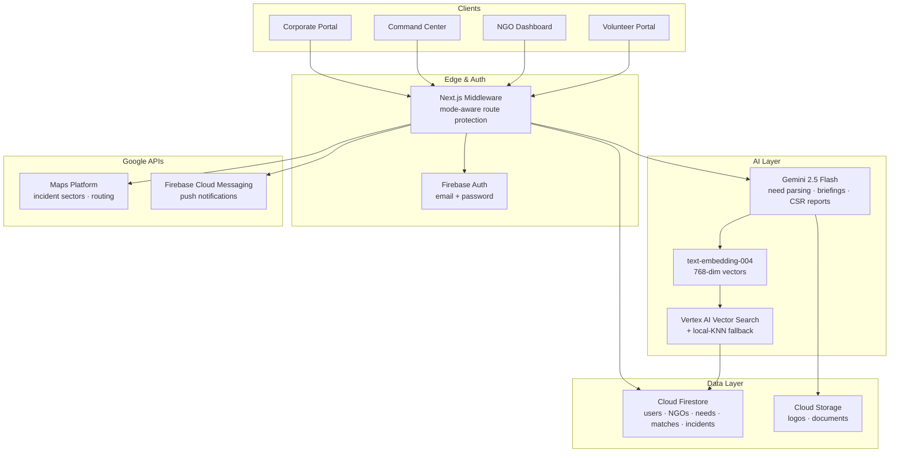

<div align="center">


<br/>

# SevaSetu
### *सेवासेतु — The Bridge of Service*

**An AI-Powered, Real-Time Volunteer Mobilization & Crisis Coordination Platform**

*Google Solution Challenge 2026 · Smart Resource Allocation Track*

<br/>

[]()
[](https://nextjs.org/)
[](https://www.typescriptlang.org/)
[](https://ai.google.dev/)
[](https://firebase.google.com/)
[](https://tailwindcss.com/)
[](https://seva-setu-4ew2.vercel.app/)

<br/>

[](https://seva-setu-4ew2.vercel.app/)
[](https://developers.google.com/community/gdsc-solution-challenge)
[](https://sdgs.un.org/goals/goal11)
[](https://sdgs.un.org/goals/goal17)

<br/>

**[Live Demo](https://seva-setu-4ew2.vercel.app/) · [Volunteer Portal](https://seva-setu-4ew2.vercel.app/volunteer) · [NGO Dashboard](https://seva-setu-4ew2.vercel.app/ngo) · [Command Center](https://seva-setu-4ew2.vercel.app/command-center) · [Impact Ledger](https://seva-setu-4ew2.vercel.app/impact)**

</div>

---

> ## *"When every minute matters, coordination shouldn't take hours."*

---

## About this repository

> **This is a demo prototype** built for the Google Solution Challenge 2026 pitch. Every screen is real, every page is wired to Firebase, and the AI endpoints make real calls to Gemini. But several capabilities marketed in the original pitch (SMS / WhatsApp fan-out, Pub/Sub event bus, BigQuery analytics, Looker dashboards) are **not implemented in this codebase** — they're scoped for the v1 production build.
>
> The split is documented honestly below: see [What's actually built today](#whats-actually-built-today) vs. [Real MVP scope](#real-mvp-scope-v1-production).

---

## The Problem

When the **Brahmaputra floods Dhemaji at 4 AM**, dozens of WhatsApp groups light up. Hundreds of people want to help. Nobody knows who has a boat, who's certified in swift-water rescue, who speaks Mising, or who can be in Majuli by sunrise. By the time NGOs sort it out, twelve hours are gone.

India has **33 lakh NGOs** and millions of willing volunteers — yet coordination during crises and everyday operations remains broken.

| Real Situation | Without SevaSetu | With SevaSetu |
|---|---|---|
| **Brahmaputra floods Dhemaji at 4 AM** | 12 WhatsApp groups, 500 willing people, nobody knows who has a boat or speaks Mising. 12 hours of chaos. | Skill-matched volunteers ranked and dispatched in seconds, with personalized briefings. |
| **Anjali wants to volunteer weekends** | Fills 5 NGO forms, hears back from none, gets pamphlet-folding despite Python skills, quits in 2 months. | A 60-second profile lands her a coding-for-kids gig in Guwahati by Saturday. |
| **NGO gets 100 DMs for one post** | 10 hours filtering, half are unqualified. | Describe the need in plain English, pre-ranked applicants arrive instantly. |

---

## Demo at a glance

The prototype is seeded with a **Brahmaputra / Assam disaster-relief scenario** so the demo feels like a real Tuesday in Guwahati. Toggle the **Demo / Actual** chip in the top-right to switch between mocked and live data.

| Surface | Path | What it shows |
|---|---|---|
| Landing | `/` | Marketing site |
| Volunteer dashboard | `/volunteer` | Anjali Borah's profile, AI-matched needs from local NGOs, an active Majuli flood-relief match |
| NGO dashboard | `/ngo` | Brahmaputra Seva Foundation's open posts, applicants, urgency triage, stats |
| Post a need (AI-assisted) | `/ngo/post` | NGO types *"need 5 swift-water rescue volunteers in Majuli Saturday"* → Gemini extracts structured fields |
| Command Center | `/command-center` | Live Dhemaji flood SITREP, river-gauge readings, sector breakdown, mobilization controls |
| CSR portal | `/corporate` | Corporate dashboard for impact reporting and team wellness drives |
| Impact ledger | `/impact` | Hours, beneficiaries, SDG mapping |
| Auth | `/login`, `/signup` | Real Firebase Auth (email + password) — bypassed in Demo Mode |

---

## What's actually built today

Concrete, runs in the box. No imaginary services.

### Frontend
- **Next.js 16** App Router, **React 19**, **TypeScript**, **Tailwind v4**
- **shadcn/ui** (Radix primitives) component system
- 25+ fully designed pages across volunteer / NGO / command-center / corporate / impact roles
- Real-time Firestore subscriptions via custom `useCollection` / `useDocument` hooks (mode-aware: returns mocks in Demo, live snapshots in Actual)
- Mode-toggle context with cookie persistence
- Empty states on every page so Actual Mode never silently falls back to mocks

### Auth
- Real **Firebase Authentication** (email + password)
- Server-side session cookies via Firebase Admin (`/api/auth/session`)
- `role` custom claim set on signup (`volunteer` | `ngo` | `coordinator` | `corporate`)
- Sign-up creates Auth user + profile doc in `volunteers/` or `ngos/` collection
- Demo Mode bypasses the login wall so reviewers can browse the prototype freely

### AI (live, with graceful fallback)

| Capability | API route | Backend |
|---|---|---|
| Parse natural-language need into structured post | `POST /api/needs/parse` | Gemini 2.5 Flash |
| Generate per-volunteer briefing for a match | `POST /api/matches/:id/briefing` | Gemini 2.5 Flash |
| Generate CSR impact report | `POST /api/reports/csr/generate` | Gemini 2.5 Flash |
| Volunteer onboarding doc → structured profile | `POST /api/onboarding/extract` | Gemini |
| Embeddings for need ↔ volunteer matching | internal | `text-embedding-004` (with deterministic mock fallback) |

If `GEMINI_API_KEY` is missing, every endpoint degrades to a deterministic mock instead of erroring out — keeping the demo always-on.

### Matching
- `POST /api/match` — embeds the need, runs **Vertex AI Vector Search** if `VECTOR_INDEX_ENDPOINT` is configured, otherwise falls back to a local cosine-similarity KNN over seeded volunteers.
- Result shape is identical in both paths, so the UI doesn't care which one ran.

### Mobilization (FCM only — see MVP for SMS/WhatsApp)
- `POST /api/mobilize` — sends **Firebase Cloud Messaging** push to selected volunteers, writes notification docs to each volunteer's `notifications` subcollection, and updates the incident's `mobilizedCount`.
- Web push subscription is wired up via `frontend/components/fcm-subscriber.tsx`.

### Database
- **Cloud Firestore** is the single source of truth.
- One-shot seeder: `node --env-file=.env.local scripts/seed-full.js` provisions 4 Auth test users + ~30 documents across `volunteers`, `ngos`, `needs`, `matches`, `incidents`, `incident_briefings`, `corporates`. Idempotent.

### Other
- **Google Maps** via `@vis.gl/react-google-maps` for incident sectors and need locations
- **`html5-qrcode`** for volunteer check-in / check-out at events
- **Vercel Analytics**

---

## Real MVP scope (v1, production)

What we ship to a real NGO partner. Built **on top of** this prototype, not from scratch.

### Must-have for v1

1. **Phone OTP login.** Email/password works for the prototype, but volunteers in Tier-2/3 cities log in with a phone number. Firebase Phone Auth on the Blaze plan.
2. **Real bulk-mobilization fan-out.** Today only FCM is wired. v1 adds:
   - **SMS** via MSG91 / Gupshup (India-localized, DLT-compliant)
   - **WhatsApp** via Meta WhatsApp Business Cloud API (template messages)
   - Per-channel delivery + read tracking written back to the match doc
3. **Vector Search at scale.** Local KNN is fine for ~100 volunteers; v1 stands up a managed Vertex AI Matching Engine index with nightly re-embed jobs.
4. **NGO verification workflow.** Today anyone can self-register as an NGO. v1 requires Darpan / 12A / 80G upload, manual review, and a verified badge.
5. **Volunteer KYC light.** Aadhaar masking + selfie liveness for high-trust deployments (child-facing roles, disaster zones).
6. **Firestore security rules.** Today the rules are open in Demo Mode. v1 ships role-based RLS — volunteers can only read their own profile, NGOs can only mutate their own needs, etc.
7. **Audit log.** Append-only `audit_events` collection so an NGO can prove who mobilized whom, when, on what evidence — required for CSR / NDMA reporting.
8. **Offline-first volunteer PWA.** Service worker + IndexedDB queue. A volunteer in a flood zone with 1 bar of EDGE still gets their match.

### Nice-to-have for v1.x (deferred from the original pitch)

- **Pub/Sub event bus** to decouple match → notify → analytics. Today these are inline awaits — fine for the prototype, won't scale past ~10K mobilizations/day.
- **BigQuery + Looker Studio** for impact analytics, SDG ledger, NGO-vs-NGO benchmarking. Today we render charts directly off Firestore aggregates.
- **Cloud Tasks** for retry/backoff on outbound notifications.
- **Multi-language UI.** Today every string is English. v1 priority order: Assamese → Hindi → Bengali → Tamil. Firestore docs already carry a `languages` field, so the data model is ready.
- **Voice onboarding.** The original pitch promised 30-second voice intros; the data model supports it (Gemini multimodal is wired) but the recording UI hasn't been built.
- **Disaster command-center → State EOC integration.** API surface for state Disaster Management Authorities to read live mobilization status during activations.

---

## Architecture

This diagram reflects what's **actually wired in the codebase** — not aspirational v1 services.



---

## Tech Stack

Only what's actually installed and imported in this repo.

<div align="center">

| Layer | Technology | Purpose |
|---|---|---|
| **Framework** | Next.js 16 (App Router, Server Components) | Full-stack, file-based routing |
| **Language** | TypeScript | Type-safe end-to-end |
| **AI — NLP** | Google Gemini 2.5 Flash | Need parsing, briefing, CSR report generation |
| **AI — Matching** | Vertex AI Vector Search (with local-KNN fallback) | Semantic matching of needs to volunteers |
| **AI — Embeddings** | `text-embedding-004` | 768-dim vectors |
| **Database** | Cloud Firestore | Real-time operational data |
| **Storage** | Cloud Storage (Firebase) | NGO logos, volunteer documents |
| **Auth** | Firebase Authentication (email + password) | Sign-in + httpOnly session cookies |
| **Push** | Firebase Cloud Messaging | Web push notifications |
| **Maps** | Google Maps Platform via `@vis.gl/react-google-maps` | Incident sectors, routing |
| **QR** | `html5-qrcode` | Volunteer check-in at venues |
| **Styling** | Tailwind CSS 4 | Utility-first, mobile-first |
| **Components** | shadcn/ui + Lucide React | Accessible UI primitives |
| **Forms** | react-hook-form + zod | Validated forms |
| **Charts** | recharts | Impact dashboards |
| **Deployment** | Vercel | Edge-deployed, instant CDN |
| **Analytics** | Vercel Analytics | Page-level metrics |

</div>

> **Not in this codebase (despite earlier docs):** Pub/Sub, BigQuery, Looker Studio, Cloud Tasks, Twilio, MSG91, WhatsApp Business API, Phone OTP, voice recording UI. All of those live under [Real MVP scope](#real-mvp-scope-v1-production).

---

## Project Structure

The codebase is split cleanly into **`backend/`** and **`frontend/`** so reviewers can see the separation of concerns at a glance. The Next.js App Router lives at the root and is the integration point.

```
seva-setu/
│
├── app/                            # Next.js App Router (thin route shells)
│   ├── api/
│   │   ├── auth/                   #   session · signup · signout
│   │   ├── needs/parse/            #   Gemini: NL → structured Need
│   │   ├── match/                  #   Vertex AI / local-KNN matching
│   │   ├── matches/[id]/briefing/  #   Gemini: per-match briefing
│   │   ├── mobilize/               #   FCM bulk push
│   │   ├── onboarding/extract/     #   Gemini: doc → structured profile
│   │   └── reports/csr/generate/   #   Gemini: CSR PDF data
│   ├── volunteer/                  # Volunteer pages
│   ├── ngo/                        # NGO pages
│   ├── command-center/             # Disaster command dashboard
│   ├── corporate/ · impact/        # Corporate & public impact pages
│   ├── login/ · signup/            # Real Firebase Auth pages
│   └── layout.tsx                  # Wraps app in <ModeProvider>
│
├── backend/                        # Server-only code (no React)
│   ├── ai/                         #   Gemini embeddings + Vertex Vector Search
│   ├── config/                     #   Mode resolution + Gemini client
│   ├── firebase/admin.ts           #   Admin SDK init
│   ├── handlers/                   #   One module per /api route, mode-aware
│   └── mock/                       #   Deterministic fixtures for Demo Mode
│
├── frontend/                       # Client + isomorphic code
│   ├── components/                 #   shadcn/ui + per-persona feature components
│   │   ├── ui/                     #     shadcn primitives
│   │   ├── app-shell/              #     Per-persona shells with mode toggle
│   │   ├── empty-state.tsx         #     Empty states for Actual Mode
│   │   └── mode-toggle.tsx         #     Demo ⇄ Actual switch
│   ├── hooks/                      #   useFirestore (mode-aware), useToast, …
│   ├── lib/
│   │   ├── auth/client.ts          #     signIn, signUp, signOut wrappers
│   │   ├── firebase/               #     Browser SDK (lazy + null-safe)
│   │   ├── mode/                   #     ModeProvider, useMode, apiFetch wrapper
│   │   └── mock-*.ts               #     Brahmaputra/Assam-themed seed data
│   └── styles/                     #   Global Tailwind / theme tokens
│
├── scripts/
│   ├── seed-full.js                #   One-shot Auth + Firestore seeder (USE THIS)
│   ├── seed.js                     #   Legacy
│   └── create-users.js             #   Users only (subset of seed-full)
│
├── proxy.ts                        # Next.js middleware: mode-aware auth gate
├── tsconfig.json                   # Path aliases
└── package.json
```

### Path aliases keep imports short

| Alias            | Resolves to                |
| ---------------- | -------------------------- |
| `@/components/*` | `./frontend/components/*`  |
| `@/hooks/*`      | `./frontend/hooks/*`       |
| `@/lib/*`        | `./frontend/lib/*`         |
| `@/frontend/*`   | `./frontend/*`             |
| `@/backend/*`    | `./backend/*`              |

---

## Demo Mode vs. Actual Mode

Every header has a visible **mode toggle**. The mode is global, persists in a cookie, and is read by both the client (`useMode()`) and the server (`resolveMode(request)`).

| | Demo Mode (default) | Actual Mode |
|---|---|---|
| Login required | **No** — public browse | Yes — Firebase Auth |
| Data source | Brahmaputra / Assam mock fixtures | Live Firestore |
| Empty Firestore | N/A — always shows mock | Shows empty states ("No active needs yet") |
| AI calls | Deterministic mocks | Real Gemini |
| FCM | No-op | Real push |
| Vector Search | Local KNN | Vertex AI if configured, else local KNN |
| Cookie | `app_mode=demo` | `app_mode=actual` |

This means **Actual Mode is fully production-ready** (no service-account keys leak into the bundle, no Gemini key reaches the browser) and **Demo Mode keeps the UX flawless** even when integrations aren't configured.

---

## Getting Started

### Prerequisites

- **Node.js 20+** and **pnpm 9+**
- A **Firebase project** with Auth (Email/Password enabled) and Firestore
- *(optional, for Actual Mode)* `GEMINI_API_KEY`, Google Maps key, FCM VAPID key, Vertex Vector Search index

### Installation

```bash
# 1. Clone the repository
git clone https://github.com/Devanshupardeshi/seva-setu.git
cd seva-setu

# 2. Install dependencies
pnpm install

# 3. Configure environment
cp .env.example .env.local
# Edit .env.local — at minimum, fill the Firebase block

# 4. Seed the database (creates 4 test users + Brahmaputra-themed data)
node --env-file=.env.local scripts/seed-full.js

# 5. Run the dev server
pnpm dev
```

Open [http://localhost:3000](http://localhost:3000).

### Seeded test credentials

After running `scripts/seed-full.js`:

| Role | Email | Password |
|---|---|---|
| Volunteer | `volunteer@sevasetu.test` | `Volunteer123!` |
| NGO admin | `ngo@sevasetu.test` | `NgoAdmin123!` |
| Coordinator | `coordinator@sevasetu.test` | `Coord123!` |
| Corporate | `corporate@sevasetu.test` | `Corp123!` |

Re-running the seeder is safe — it `set({ merge: true })` everything.

### Environment Variables

The minimum to run the prototype with Auth + Firestore working:

```env
# Public — from Firebase Console → Project Settings → Web app config
NEXT_PUBLIC_FIREBASE_API_KEY=
NEXT_PUBLIC_FIREBASE_AUTH_DOMAIN=
NEXT_PUBLIC_FIREBASE_PROJECT_ID=
NEXT_PUBLIC_FIREBASE_STORAGE_BUCKET=
NEXT_PUBLIC_FIREBASE_MESSAGING_SENDER_ID=
NEXT_PUBLIC_FIREBASE_APP_ID=

# Server — from your Firebase service-account JSON
FIREBASE_PROJECT_ID=
FIREBASE_CLIENT_EMAIL=
FIREBASE_PRIVATE_KEY=
```

**Optional** (only needed in Actual Mode for the corresponding feature):

```env
GEMINI_API_KEY=                      # AI parsing, briefings, CSR reports
NEXT_PUBLIC_GOOGLE_MAPS_API_KEY=     # Incident maps
NEXT_PUBLIC_FIREBASE_VAPID_KEY=      # FCM web push
GCP_PROJECT=                         # Vertex Vector Search
GCP_LOCATION=us-central1
VECTOR_INDEX_ENDPOINT=
VECTOR_INDEX_DEPLOYED_ID=
```

Every optional dependency degrades gracefully — the app stays usable even if you only configure the Firebase block.

---

## API Reference

| Route | Method | Purpose |
|---|---|---|
| `/api/auth/session` | POST · GET · DELETE | Mint, verify, clear the httpOnly session cookie |
| `/api/auth/signup` | POST | Create Auth user + profile doc + `role` claim |
| `/api/auth/signout` | POST | Clear session cookie |
| `/api/needs/parse` | POST | NL → structured need (Gemini) |
| `/api/match` | POST | Embed need, return top-K volunteers (Vertex or local KNN) |
| `/api/matches/[id]/briefing` | POST | Generate per-match briefing (Gemini) |
| `/api/mobilize` | POST | Fan-out FCM + write notification inbox docs |
| `/api/onboarding/extract` | POST | Volunteer doc → structured profile (Gemini) |
| `/api/reports/csr/generate` | POST | CSR impact report (Gemini) |

All routes accept the mode flag and return `{ ok, mode, ..., usedFallback? }` so the client can render a real / demo / fallback indicator.

---

## Live Build Status

| Module | Status | Notes |
|---|:---:|---|
| Landing page | Live | Marketing site |
| Email/password auth | Live | Firebase Auth + httpOnly session cookies |
| Volunteer Portal | Live | Real-time matches, profile, briefings |
| NGO Dashboard | Live | Real-time needs, applicants, stats |
| Command Center | Live | Live SITREP, sector breakdown, mobilization |
| Corporate Portal | Live | CSR dashboard, wellness drives |
| Impact Ledger | Live | Hours, beneficiaries, SDG mapping |
| Gemini AI endpoints | Live | Need parse · briefing · CSR · onboarding extract |
| Vertex AI Vector Search | Live | With local-KNN fallback |
| Maps & Geofencing | Live | Google Maps Platform |
| FCM Push | Live | Token registration + bulk send |
| QR check-in | Live | `html5-qrcode` |
| Phone OTP | Planned (v1) | See Real MVP scope |
| SMS / WhatsApp fan-out | Planned (v1) | See Real MVP scope |
| Voice onboarding UI | Planned (v1) | Backend ready, UI pending |
| Pub/Sub · BigQuery · Looker | Planned (v1.x) | See Real MVP scope |

---

## UN SDG Alignment

<div align="center">

| Goal | Our Contribution |
|------|-----------------|
| **SDG 3** — Good Health & Well-being | Faster medical volunteer dispatch in disasters |
| **SDG 4** — Quality Education | Skill-matched tutors connected to under-resourced NGOs |
| **SDG 5** — Gender Equality | Women-only task filters, safety routing |
| **SDG 10** — Reduced Inequalities | Removes friction barriers to civic participation |
| **SDG 11** — Sustainable Cities & Communities | Civic coordination layer for every Indian city |
| **SDG 17** — Partnerships for the Goals | One platform joining NGOs, volunteers, government & corporates |

</div>

---

## Roadmap

| Stage | What | When |
|---|---|---|
| **Now (this repo)** | Working demo prototype, real auth, real Gemini, FCM, Brahmaputra/Assam seed data | Shipped |
| **v1 (next)** | Phone OTP · SMS via MSG91 · NGO verification · security rules · audit log · WhatsApp Business API · offline PWA · multi-language UI | Q1 |
| **v1.x** | Pub/Sub event bus · BigQuery + Looker · Cloud Tasks · State EOC integrations · Voice onboarding UI | Q2 |

---

## Contributing

```bash
git checkout -b feature/your-feature-name
git commit -m "feat: describe your change"
git push origin feature/your-feature-name
# Open a Pull Request
```

---

## License

© 2026 **Devanshu Pardeshi** & The SevaSetu Team · All rights reserved.
Built for the Google Solution Challenge 2026.
