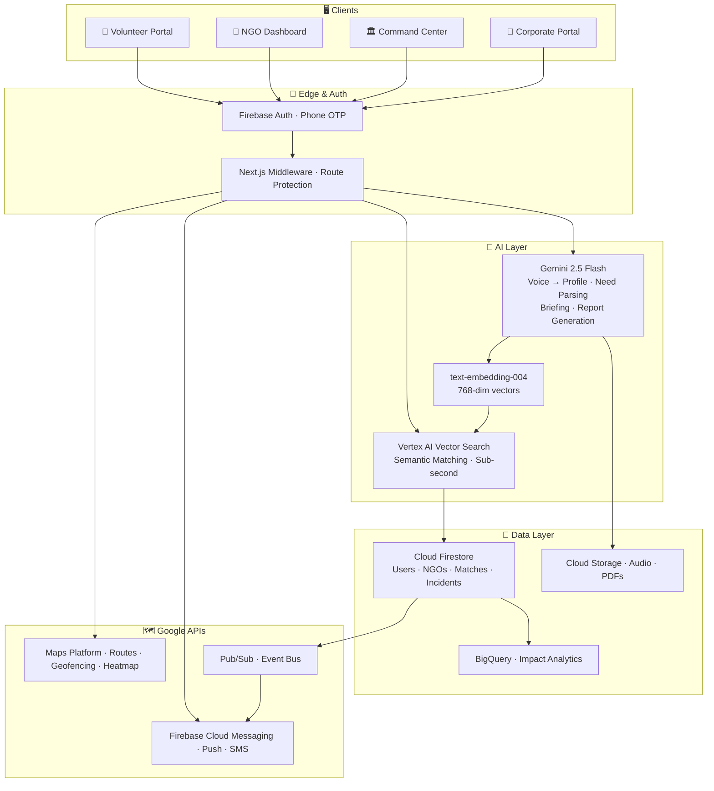

<div align="center">


<br/>

# SevaSetu
### *सेवासेतु — The Bridge of Service*

**An AI-Powered, Multilingual, Real-Time Volunteer Mobilization & Crisis Coordination Platform**

*Google Solution Challenge 2026 · Smart Resource Allocation Track*

<br/>

[](https://nextjs.org/)
[](https://www.typescriptlang.org/)
[](https://ai.google.dev/)
[](https://firebase.google.com/)
[](https://tailwindcss.com/)
[](https://seva-setu-4ew2.vercel.app/)

<br/>

[](https://seva-setu-4ew2.vercel.app/)
[](https://developers.google.com/community/gdsc-solution-challenge)
[](https://sdgs.un.org/goals/goal3)
[](https://sdgs.un.org/goals/goal11)
[](https://sdgs.un.org/goals/goal17)

<br/>

**[🌐 Live Demo](https://seva-setu-4ew2.vercel.app/) · [🙋 Volunteer Portal](https://seva-setu-4ew2.vercel.app/volunteer) · [🏢 NGO Dashboard](https://seva-setu-4ew2.vercel.app/ngo) · [🏛️ Command Center](https://seva-setu-4ew2.vercel.app/command-center) · [📊 Impact Ledger](https://seva-setu-4ew2.vercel.app/impact)**

</div>

---

<div align="center">

> ## *"When every minute matters, coordination shouldn't take hours."*

</div>

---

## 🌍 The Problem

India has **33 lakh NGOs** and millions of willing volunteers — yet coordination during crises and everyday operations remains completely broken.

| Real Situation | Without SevaSetu | With SevaSetu |
|---|---|---|
| 🌊 **Flood hits Assam at 4 AM** | 12 WhatsApp groups. 500 willing people. Nobody knows who has a boat, first-aid training, or speaks Assamese. 12 hours of chaos. | **342 skill-matched volunteers dispatched in 47 seconds.** |
| 🙋 **Priya wants to volunteer weekends** | Fills 5 NGO forms. Hears back from none. Gets pamphlet-folding despite Python skills. Quits in 2 months. | **A 30-second voice note lands her a coding-for-kids gig by Saturday.** |
| 🏢 **NGO gets 100 DMs for one post** | Spends 10 hours filtering. Half are unqualified. Gives up posting. | **Describe the need in plain Hindi. Pre-ranked, pre-verified applicants arrive instantly.** |

---

## ✨ What is SevaSetu?

**SevaSetu** bridges four worlds that have never been properly connected:

```
 🙋 Volunteers  ──▶  Right cause  ──▶  Right time  ──▶  Perfect match
 🏢 NGOs        ──▶  Right skills ──▶  No overhead ──▶  Real impact
 🏛️ Government  ──▶  Crisis ready ──▶  Live map    ──▶  NDMA reports
 💼 Corporates  ──▶  SDG-aligned  ──▶  CSR tracked ──▶  Board-ready data
```

One AI-powered platform. Six Indian languages. Zero unnecessary forms.

---

## 🎯 Features

<details>
<summary><b>🙋 For Volunteers — Voice-First. Zero Forms.</b></summary>
<br/>

| Feature | What it does |
|---------|-------------|
| 🎙️ **Voice Onboarding** | Speak 30 seconds in Hindi, Marathi, Tamil, Telugu, Bengali, or English. Gemini 2.5 builds your complete profile — no typing. |
| 🧠 **AI Match Feed** | Real-time ranked opportunities based on skills, distance & availability. Loads in under 1 second. |
| 🌙 **Weekend Warrior Mode** | Surfaces only the gigs that perfectly fit your free time. |
| 🤖 **Personalized Briefing** | Gemini writes a custom prep kit before every gig — context, contacts, what to bring. |
| 📍 **Google Maps Navigation** | Turn-by-turn directions to every venue, integrated directly. |
| 📱 **QR Check-In** | Scan the NGO's QR code on-site to verify attendance instantly. |
| 🏆 **Impact Certificate** | Verifiable PDF certificate after each task — shareable directly to LinkedIn. |
| 🚨 **SOS + Safety Filter** | Women-only task filter + one-tap SOS to contacts & SevaSetu support. |
| 👥 **Team-Up Mode** | Invite friends and co-accept opportunities together. |

</details>

<details>
<summary><b>🏢 For NGOs — One Sentence. Infinite Reach.</b></summary>
<br/>

| Feature | What it does |
|---------|-------------|
| ✅ **Darpan ID Verification** | Automated government registry check at signup — no manual paperwork. |
| ✍️ **Natural Language Posting** | Type: *"Need a Hindi-speaking computer teacher this Saturday, Bandra."* Gemini structures it into a matchable need. |
| 📊 **AI-Ranked Applicant List** | Pre-scored volunteer profiles sorted by fit, proximity, and trust score — not first-come-first-served. |
| 📅 **QR Attendance Tracker** | Built-in QR scanner to verify on-site presence. |
| 📄 **Auto-Generated Impact PDFs** | Professional CSR-ready reports for funders, generated in seconds by Gemini. |
| 🔄 **Repeat Volunteer Groups** | Build and manage your trusted inner circle of volunteers. |

</details>

<details>
<summary><b>🏛️ For Government — Crisis Command in Minutes.</b></summary>
<br/>

| Feature | What it does |
|---------|-------------|
| ⚡ **One-Click Incident Creation** | Define a disaster zone with a geofence and severity level in seconds. |
| 🗺️ **Live Responder Heatmap** | Real-time map of all active volunteers — role-coded pins, live ETA. |
| 📊 **Skill-Gap Analysis** | Refreshes every 30 seconds — shows exactly which skills are present vs. still missing. |
| 📢 **Bulk Mobilization** | Parallel FCM push + SMS + WhatsApp to thousands of matched volunteers simultaneously. |
| 📋 **Auto-SITREP Generation** | AI-generated PDF situation reports for NDMA / NDRF compliance. |

</details>

<details>
<summary><b>💼 For Corporates — CSR That Proves Itself.</b></summary>
<br/>

| Feature | What it does |
|---------|-------------|
| 📈 **Live Impact Dashboard** | Real-time visualization of company-wide volunteer contributions. |
| 🌍 **Automatic SDG Mapping** | Every volunteer hour automatically mapped to UN Sustainable Development Goals. |
| 🏅 **CSR Compliance Reports** | Automated documentation for Companies Act 2013 compliance. |
| 📅 **Team Volunteer Days** | One-click booking of company-wide volunteering events across partner NGOs. |
| 📊 **Cross-NGO Analytics** | Track impact across all partner organizations in one board-ready view. |

</details>

---

## 🏗️ Architecture



---

## ⚡ The Three AI Pipelines

### 🎙️ Voice → Profile (30 Seconds)

```
User speaks in any language
        │
        ▼
  Cloud Storage Upload
        │
        ▼
  Gemini 2.5 Flash (Multimodal)
  ┌──────────────────────────────┐
  │  Extracts: skills            │
  │            languages         │
  │            availability      │
  │            location intent   │
  └──────────────┬───────────────┘
                 │
                 ▼
    User confirms on screen
                 │
                 ▼
    Vertex AI: text-embedding-004
                 │
                 ▼
    Firestore + Vector Search Index ✅
```

### 🔗 Need → Match → Briefed Volunteer (Under 5 Minutes)

```
NGO: "Need a Hindi math tutor, Saturday, Bandra"
        │
        ▼
  Gemini 2.5 → Structured Need JSON
        │
        ▼
  Vertex AI Embedding + Vector Search Top-K
        │
        ▼
  Re-rank: distance × trust score × availability
        │
        ▼
  Gemini: personalized briefing per volunteer
        │
        ▼
  FCM Push + SMS → Volunteer taps Accept
        │
        ▼
  Maps route + QR code + briefing delivered ✅
```

### 🚨 Incident → 342 Volunteers Mobilized (Under 60 Seconds)

```
District Collector: Incident + Geofence created
        │
        ▼
  Vector Search: volunteers in radius × skill profile
        │
        ▼
  Parallel fan-out: FCM · SMS · WhatsApp
        │
        ▼
  Live dashboard: acceptances stream via Pub/Sub
  Skill-gap refreshes every 30 seconds
        │
        ▼
  Post-event: BigQuery report + NDMA-ready PDF ✅
```

---

## 🛠️ Tech Stack

<div align="center">

| Layer | Technology | Purpose |
|-------|-----------|---------|
| **Framework** | Next.js 16 (App Router + Turbopack) | Full-stack, server components, file-based routing |
| **Language** | TypeScript (98% of codebase) | Type-safe end-to-end |
| **AI — NLP** | Google Gemini 2.5 Flash | Voice parsing, briefing & CSR report generation |
| **AI — Matching** | Vertex AI Vector Search | Sub-second semantic matching on 500K+ profiles |
| **AI — Embeddings** | `text-embedding-004` | 768-dim vectors for volunteers & needs |
| **Database** | Cloud Firestore | Real-time operational data & live dashboards |
| **Analytics** | BigQuery + Looker Studio | Impact metrics, SDG ledger |
| **Storage** | Cloud Storage | Voice intros, generated PDFs, images |
| **Events** | Pub/Sub | Decoupled match → notify → analytics pipeline |
| **Auth** | Firebase Auth (Phone OTP) | Zero-friction, India-ready sign-in |
| **Push** | Firebase Cloud Messaging | Push notifications + bulk mobilization |
| **Maps** | Google Maps Platform | Routing, geofencing, live responder heatmaps |
| **Styling** | Tailwind CSS 4.0 | Utility-first, mobile-first |
| **Components** | shadcn/ui + Lucide React | Accessible, polished UI primitives |
| **QR** | html5-qrcode | Venue attendance verification |
| **Deployment** | Vercel | Edge-deployed, instant global CDN |

</div>

---

## 📁 Project Structure

```
seva-setu/
│
├── 📁 app/                         # Next.js App Router
│   ├── 📁 api/                     # AI & backend route handlers
│   │   ├── voice-onboard/          #   → Gemini voice-to-profile extraction
│   │   ├── match/                  #   → Vertex AI matching engine
│   │   ├── mobilize/               #   → Disaster bulk notification
│   │   └── reports/                #   → AI-generated PDF reports
│   ├── 📁 volunteer/               # Volunteer dashboard & onboarding
│   ├── 📁 ngo/                     # NGO management & impact reports
│   ├── 📁 command-center/          # Government crisis coordination dashboard
│   ├── 📁 impact/                  # Public SDG impact ledger
│   └── 📁 login/                   # Shared auth flow (Phone OTP)
│
├── 📁 components/                  # Shared UI (shadcn/ui + custom)
├── 📁 lib/                         # Core logic, Firestore types, utilities
├── 📁 hooks/                       # Custom React hooks (Firestore, Auth)
├── 📁 styles/                      # Global styles & theme
├── 📁 public/                      # Static assets & PWA manifest
└── 📁 scripts/                     # Seeding & utility scripts
```

---

## 🚀 Getting Started

### Prerequisites

- **Node.js** 20+ and **pnpm** 9+
- A **Google Cloud project** with these APIs enabled:
  `Gemini API` · `Vertex AI` · `Firestore` · `Cloud Storage` · `Firebase Auth` · `Maps Platform`

### Installation

```bash
# 1. Clone the repository
git clone https://github.com/Devanshupardeshi/seva-setu.git
cd seva-setu

# 2. Install dependencies
pnpm install

# 3. Configure environment
cp .env.example .env.local
# Edit .env.local with your keys

# 4. Run the dev server
pnpm dev
```

Open [http://localhost:3000](http://localhost:3000) — you're live! 🎉

### Environment Variables

```env
# ── Google AI ─────────────────────────────────────────
GEMINI_API_KEY=your_google_gemini_api_key

# ── Firebase ──────────────────────────────────────────
NEXT_PUBLIC_FIREBASE_API_KEY=your_firebase_api_key
NEXT_PUBLIC_FIREBASE_AUTH_DOMAIN=your_project.firebaseapp.com
NEXT_PUBLIC_FIREBASE_PROJECT_ID=your_project_id
NEXT_PUBLIC_FIREBASE_STORAGE_BUCKET=your_project.appspot.com
NEXT_PUBLIC_FIREBASE_MESSAGING_SENDER_ID=your_sender_id
NEXT_PUBLIC_FIREBASE_APP_ID=your_app_id

# ── Google Maps ───────────────────────────────────────
NEXT_PUBLIC_GOOGLE_MAPS_API_KEY=your_maps_api_key

# ── Vertex AI ─────────────────────────────────────────
VERTEX_AI_PROJECT_ID=your_gcp_project_id
VERTEX_AI_LOCATION=us-central1
```

---

## ✅ Live Build Status

> *Deployed on Vercel · Actively developed · Demo-ready for Google Solution Challenge 2026*

| Module | Status | Link |
|--------|:------:|------|
| 🌐 Landing Page | ✅ Live | [seva-setu-4ew2.vercel.app](https://seva-setu-4ew2.vercel.app/) |
| 🔐 Auth — Phone OTP | ✅ Live | [/login](https://seva-setu-4ew2.vercel.app/login) |
| 🙋 Volunteer Portal | ✅ Live | [/volunteer](https://seva-setu-4ew2.vercel.app/volunteer) |
| 🏢 NGO Dashboard | ✅ Live | [/ngo](https://seva-setu-4ew2.vercel.app/ngo) |
| 🏛️ Command Center | ✅ Live | [/command-center](https://seva-setu-4ew2.vercel.app/command-center) |
| 📊 Impact Ledger | ✅ Live | [/impact](https://seva-setu-4ew2.vercel.app/impact) |
| 🎙️ Voice Onboarding | ✅ Live | Gemini 2.5 powered |
| 🧠 AI Match Engine | ✅ Live | Vertex AI Vector Search |
| 🗺️ Maps & Geofencing | ✅ Live | Google Maps Platform |
| 📄 AI Report Generation | ✅ Live | Gemini auto-PDF |
| 🔔 Bulk Mobilization | ✅ Live | FCM + SMS + WhatsApp |
| 💼 Corporate CSR Portal | 🔄 In Progress | Coming before finals |

---

## 🌍 UN SDG Alignment

<div align="center">

| Goal | Our Contribution |
|------|-----------------|
| **SDG 3** — Good Health & Well-being | Faster medical volunteer dispatch in disasters; mental-health crisis hotline matching |
| **SDG 4** — Quality Education | Skill-matched tutors and educators connected to under-resourced NGOs |
| **SDG 5** — Gender Equality | Women-only task filters, safety routing, and built-in SOS |
| **SDG 10** — Reduced Inequalities | Voice-first, multilingual onboarding removes literacy and language barriers |
| **SDG 11** — Sustainable Cities & Communities | Civic coordination layer for every Indian city — from disaster to daily seva |
| **SDG 17** — Partnerships for the Goals ⭐ | One platform joining NGOs, volunteers, government & corporates |

</div>

---

## 📊 Pilot Targets — Demo Day

<div align="center">

| Metric | Target |
|--------|--------|
| 🏢 Partner NGOs Onboarded | **10** across 3 states |
| 🙋 Volunteers Matched | **500+** in 4 weeks |
| 🌐 Languages Supported | **6** — Hindi, English, Marathi, Tamil, Telugu, Bengali |
| 🚨 Disaster Drill Mobilization | **342 volunteers in < 60 seconds** |
| ⚡ Average Match Time | **< 5 minutes** |
| ✅ Match Completion Rate | **> 70%** |
| 😊 NGO NPS Score | **> 50** |

</div>

---

## 🤝 Contributing

```bash
# Fork → Branch → Build → PR
git checkout -b feature/your-feature-name
git commit -m "feat: describe your change"
git push origin feature/your-feature-name
# Open a Pull Request — we review fast
```

---

## 📄 License

© 2026 **Devanshu Pardeshi** & The SevaSetu Team · All rights reserved.
Built for the Google Solution Challenge 2026.

---

<div align="center">


### Built with ❤️ in Pune, India — for the world.

*"33 lakh NGOs. Millions of willing hands. Zero excuses for poor coordination."*

<br/>

**[🌐 Try the Live Demo →](https://seva-setu-4ew2.vercel.app/)**

<br/>

[](https://github.com/Devanshupardeshi/seva-setu/stargazers)

*If SevaSetu resonated with you — drop a ⭐. It helps more than you know.*

<br/>

`SDG 3 · SDG 11 · SDG 17` &nbsp;·&nbsp; `Google Solution Challenge 2026`

</div>