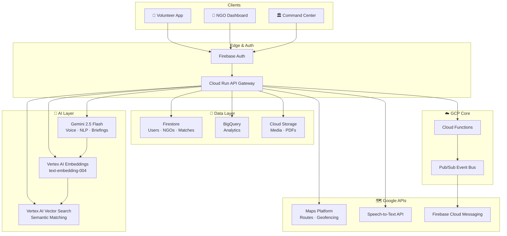

<div align="center">


<br/>

**An AI-Powered, Multilingual, Real-Time Volunteer Mobilization & CSR Impact Platform**

*Built for the Google Solution Challenge 2026*

<br/>

[](https://nextjs.org/)
[](https://www.typescriptlang.org/)
[](https://ai.google.dev/)
[](https://firebase.google.com/)
[](https://tailwindcss.com/)

<br/>

[](https://developers.google.com/community/gdsc-solution-challenge)
[](https://sdgs.un.org/goals/goal11)
[](https://sdgs.un.org/goals/goal17)
[](https://sdgs.un.org/goals/goal3)
[](LICENSE)

<br/>

[🚀 Live Demo](#) · [📹 Demo Video](#) · [📋 PRD](prd.txt) · [🐛 Report Bug](https://github.com/Devanshupardeshi/seva-setu/issues)

</div>

---

## 🌟 The Problem We're Solving

<table>
<tr>
<td width="50%">

> *"During the 2024 Wayanad floods, coordination happened entirely over WhatsApp. Thousands of volunteers were willing to help — but hours were wasted just figuring out who goes where."*

India has **33 lakh NGOs** yet zero unified volunteer infrastructure:

- 🚫 **~70% volunteer drop-off** within 3 months due to poor matching
- 🚫 **Hours lost** in crisis coordination via informal channels  
- 🚫 **Small NGOs** have no HR capacity to filter applicants
- 🚫 **CSR impact** is unmeasured and misreported

</td>
<td width="50%">

```
The Gap is Real:
┌─────────────────────────────────┐
│  33,00,000 NGOs in India        │
│  Millions of willing volunteers │
│                                 │
│      ✗ No unified platform      │
│      ✗ Language barriers        │
│      ✗ No crisis coordination   │
│      ✗ No impact accountability │
│                                 │
│  → SevaSetu bridges this gap    │
└─────────────────────────────────┘
```

</td>
</tr>
</table>

---

## 💡 What is SevaSetu?

**SevaSetu** *(Sanskrit: सेवासेतु — "Bridge of Service")* is a next-generation platform that uses **Google Gemini 2.5 Flash**, **Vertex AI Vector Search**, and **Google Maps Platform** to intelligently connect:

- 🙋 **Volunteers** ↔ with the right causes, in real-time
- 🏢 **NGOs** ↔ with the right skills, without the overhead
- 🏛️ **Government** ↔ with coordinated crisis response
- 💼 **Corporates** ↔ with measurable, SDG-aligned CSR impact

> *Coordination shouldn't take hours when every minute matters.*

---

## 🎯 Key Features by User Role

<details>
<summary><b>🙋 For Volunteers — Voice-First, Zero Forms</b></summary>

<br/>

| Feature | Description |
|---------|-------------|
| 🎙️ **Voice Onboarding** | Speak for 30 seconds in your language. Gemini builds your full structured profile — no typing required. |
| 🧠 **Smart Match Feed** | AI-ranked opportunities based on your skills, location & availability — loads in under 1 second. |
| 🌙 **Weekend Warrior Mode** | Surfaces opportunities that perfectly fit your free time slots. |
| 📍 **Maps-Powered Navigation** | Turn-by-turn directions to every volunteering venue via Google Maps. |
| 📱 **QR Check-In** | Scan and verify your on-site attendance instantly. |
| 🏆 **Impact Portfolio** | Verifiable PDF certificates shareable directly to LinkedIn. |
| 🚨 **SOS Safety Filter** | One-tap emergency alert to contacts + SevaSetu support. |
| 👥 **Team-Up Mode** | Invite friends and co-accept opportunities together. |

</details>

<details>
<summary><b>🏢 For NGOs — One Sentence, Infinite Reach</b></summary>

<br/>

| Feature | Description |
|---------|-------------|
| ✍️ **Natural Language Posting** | Type: *"Need 5 people for a food drive in Bandra this Sunday morning."* Gemini does the rest. |
| ✅ **Darpan ID Verification** | Automated government registry verification on signup. |
| 📊 **Ranked Applicant List** | AI-scored volunteer profiles sorted by fit — not just first-come-first-served. |
| 📅 **Attendance Tracker** | QR-based on-site attendance scanner built right in. |
| 📄 **Auto-Generated Impact PDFs** | Professional CSR-ready reports for funders, generated in seconds. |
| 🔄 **Repeat Volunteer Management** | Build and manage your trusted volunteer community. |

</details>

<details>
<summary><b>🏛️ For Government — Crisis Command in Minutes</b></summary>

<br/>

| Feature | Description |
|---------|-------------|
| ⚡ **One-Click Incident Creation** | Define a disaster zone with a geofence and radius in seconds. |
| 🗺️ **Live Responder Heatmap** | Real-time map of all active volunteers in the affected zone. |
| 📊 **Skill-Gap Analysis** | Instant visualization of which skills are present vs. still needed. |
| 📢 **Bulk Mobilization** | Parallel FCM push + SMS + WhatsApp to hundreds of matched volunteers simultaneously. |
| 📋 **Auto-SITREP Generation** | AI-generated PDF situation reports for NDMA compliance. |

</details>

<details>
<summary><b>💼 For Corporates — CSR Intelligence Dashboard</b></summary>

<br/>

| Feature | Description |
|---------|-------------|
| 📈 **Live Impact Dashboard** | Real-time visualization of company-wide volunteer contributions. |
| 🌍 **Automatic SDG Mapping** | Every volunteer hour is automatically mapped to UN Sustainable Development Goals. |
| 🏅 **Compliance Reports** | Automated documentation for Companies Act 2013 CSR compliance. |
| 📊 **Looker Studio Embed** | Public impact dashboard for annual reports and investor decks. |

</details>

---

## 🏗️ System Architecture



---

## ⚡ The Two Core AI Pipelines

### 🎙️ Pipeline 1 — Voice-to-Profile Onboarding

```
Volunteer speaks 30s  ──▶  Cloud Storage Upload  ──▶  Gemini 2.5 Flash
                                                            │
                                                            ▼
                                               Structured JSON extracted:
                                               { skills, languages,
                                                 availability, location }
                                                            │
                                                            ▼
                                               User confirms on screen
                                                            │
                                                            ▼
                                          Vertex AI Embedding (768-dim)
                                                            │
                                                            ▼
                                          Firestore + Vector Search Index ✅
```

### 🔗 Pipeline 2 — Intelligent Matching

```
NGO types need in plain text
         │
         ▼
  Gemini 2.5 parses → Structured Need JSON
         │
         ▼
  Vertex AI Embedding generated
         │
         ▼
  Vector Search: Top-K nearest volunteers
         │
         ▼
  Re-ranking: distance × availability × trust score
         │
         ▼
  Gemini generates personalized briefing per volunteer
         │
         ▼
  FCM Push + SMS → Volunteer accepts
         │
         ▼
  Pub/Sub: match.created event → Maps route + QR + briefing delivered ✅
```

---

## 🛠️ Tech Stack

<div align="center">

| Layer | Technology | Purpose |
|-------|-----------|---------|
| **Frontend** | Next.js 16 (App Router) | NGO & Government dashboards |
| **Language** | TypeScript 98% | Type-safe full-stack |
| **AI Engine** | Google Gemini 2.5 Flash | Voice parsing, matching, report generation |
| **Vector Search** | Vertex AI Vector Search | Sub-second semantic matching on 500K+ profiles |
| **Embeddings** | `text-embedding-004` | 768-dim volunteer & need vectors |
| **Database** | Cloud Firestore | Real-time operational data |
| **Analytics** | BigQuery + Looker Studio | Impact metrics & CSR reporting |
| **Storage** | Cloud Storage | Audio, PDFs, profile images |
| **Events** | Pub/Sub | Decoupled match, notify & analytics pipeline |
| **Maps** | Google Maps Platform | Routing, geofencing, live heatmaps |
| **Auth** | Firebase Auth (Phone OTP) | Zero-friction Indian user onboarding |
| **Notifications** | Firebase Cloud Messaging | Push + SMS mobilization |
| **Styling** | Tailwind CSS 4.0 | Utility-first responsive UI |
| **Components** | shadcn/ui + Lucide React | Accessible, beautiful UI primitives |
| **QR Scanning** | html5-qrcode | Venue attendance verification |

</div>

---

## 📁 Project Structure

```
seva-setu/
│
├── 📁 app/                         # Next.js App Router
│   ├── 📁 api/                     # AI & Backend route handlers
│   │   ├── voice-onboard/          #   → Gemini voice extraction endpoint
│   │   ├── match/                  #   → Vector Search matching engine
│   │   └── mobilize/               #   → Disaster bulk notification
│   ├── 📁 volunteer/               # Volunteer dashboard & onboarding flow
│   ├── 📁 ngo/                     # NGO management & impact reports
│   ├── 📁 command-center/          # Government crisis coordination dashboard
│   └── 📁 corporate/              # CSR intelligence portal
│
├── 📁 components/                  # UI components (shadcn/ui + custom)
├── 📁 lib/                         # Core logic, Firestore types & mock data
├── 📁 hooks/                       # Custom React hooks (Firestore, Auth)
├── 📁 styles/                      # Global styles & Tailwind config
├── 📁 public/                      # Static assets & PWA manifest
├── 📁 scripts/                     # Seeding & utility scripts
│
├── middleware.ts                   # Auth-gated route protection
├── next.config.mjs                 # Next.js + image domain config
├── prd.txt                         # Full Product Requirements Document
└── remaining.txt                   # Feature backlog tracker
```

---

## 🚀 Getting Started

### Prerequisites

- **Node.js** 20+
- **pnpm** 9+
- A **Google Cloud** project with the following APIs enabled:
  - Gemini API · Vertex AI · Cloud Firestore · Cloud Storage · Firebase Auth · Maps Platform

### Installation

```bash
# 1. Clone the repository
git clone https://github.com/Devanshupardeshi/seva-setu.git
cd seva-setu

# 2. Install dependencies
pnpm install

# 3. Configure environment variables
cp .env.example .env.local
```

### Environment Variables

Create a `.env.local` file in the root directory:

```env
# ── Google AI ──────────────────────────────────────
GEMINI_API_KEY=your_google_gemini_api_key

# ── Firebase (Client-side) ─────────────────────────
NEXT_PUBLIC_FIREBASE_API_KEY=your_firebase_api_key
NEXT_PUBLIC_FIREBASE_AUTH_DOMAIN=your_project.firebaseapp.com
NEXT_PUBLIC_FIREBASE_PROJECT_ID=your_project_id
NEXT_PUBLIC_FIREBASE_STORAGE_BUCKET=your_project.appspot.com
NEXT_PUBLIC_FIREBASE_MESSAGING_SENDER_ID=your_sender_id
NEXT_PUBLIC_FIREBASE_APP_ID=your_app_id

# ── Google Maps ────────────────────────────────────
NEXT_PUBLIC_GOOGLE_MAPS_API_KEY=your_maps_api_key

# ── Vertex AI ──────────────────────────────────────
VERTEX_AI_PROJECT_ID=your_gcp_project_id
VERTEX_AI_LOCATION=us-central1
```

### Run the Development Server

```bash
pnpm dev
```

Open [http://localhost:3000](http://localhost:3000) and you're live! 🎉

---

## 🗺️ Roadmap

```
Week 1  ████████  ✅  GCP Setup · Firebase Schema · CI/CD
Week 2  ████████  ✅  Phone Auth · Volunteer & NGO Profiles
Week 3  ████████  ✅  Voice Onboarding Pipeline (the wow-moment)
Week 4  ████████  ✅  NGO Need Posting + Gemini Parsing
Week 5  ████████  ✅  Matching Engine + Briefing Generation
Week 6  ████████  🔄  Disaster Command Center + Live Map
Week 7  ░░░░░░░░  📋  Trust Score + Certificates + Safety
Week 8  ░░░░░░░░  📋  Multilingual QA + BigQuery Analytics
Week 9  ░░░░░░░░  📋  Pilot: 10 NGOs · 500 Volunteers · Drill
Week 10 ░░░░░░░░  📋  Demo Video + Pitch + Final Submission
```

---

## 🌍 UN SDG Alignment

<div align="center">

| Goal | Contribution |
|------|-------------|
| **SDG 3** — Good Health & Well-Being | Rapid disaster medical volunteer coordination |
| **SDG 4** — Quality Education | Skill-based matching for education NGOs |
| **SDG 5** — Gender Equality | Women-only task filters & safety routing |
| **SDG 10** — Reduced Inequalities | Inclusive voice-first onboarding across literacy levels |
| **SDG 11** — Sustainable Cities | Geofenced disaster management & urban resilience |
| **SDG 17** — Partnerships for the Goals | ✨ Core mission — bridging NGOs, volunteers, govt & corporates |

</div>

---

## 📊 Success Metrics

<div align="center">

| Metric | Target by Demo Day |
|--------|-------------------|
| 🙋 Daily Active Volunteers | **200** |
| ⚡ Average Match Time | **< 5 minutes** |
| 🚨 Disaster Mobilization (50 volunteers) | **< 10 minutes** |
| 🏢 NGO Partner Satisfaction (NPS) | **> 50** |
| ✅ Match Completion Rate | **> 70%** |
| 🌐 Indian Languages Supported | **5+** |

</div>

---

## 🤝 Contributing

We welcome contributions! Here's how to get started:

```bash
# Fork and clone the repo
git checkout -b feature/your-amazing-feature

# Make your changes, then commit
git commit -m "feat: add your amazing feature"

# Push and open a Pull Request
git push origin feature/your-amazing-feature
```

Please read our [Contributing Guidelines](CONTRIBUTING.md) and make sure your PR aligns with the active sprint in [remaining.txt](remaining.txt).

---

## 📄 License

This project was built for the **Google Solution Challenge 2026**. All rights reserved © 2026 Devanshu Pardeshi & The SevaSetu Team.

---

<div align="center">

### Built with ❤️ in India, for India

**Devanshu Pardeshi** & The SevaSetu Team · Pune, Maharashtra

<br/>

*"33 lakh NGOs. Millions of willing hands. Zero excuses for poor coordination."*

<br/>

[](https://github.com/Devanshupardeshi/seva-setu/stargazers)
[](https://github.com/Devanshupardeshi/seva-setu/forks)

<br/>

*If SevaSetu inspired you — drop a ⭐ and share it with someone who can use it.*

</div>